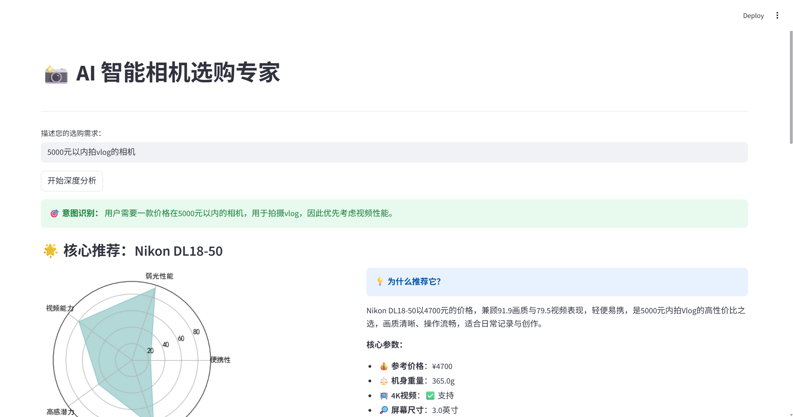
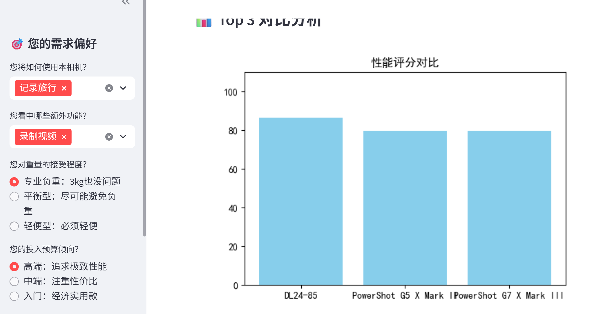
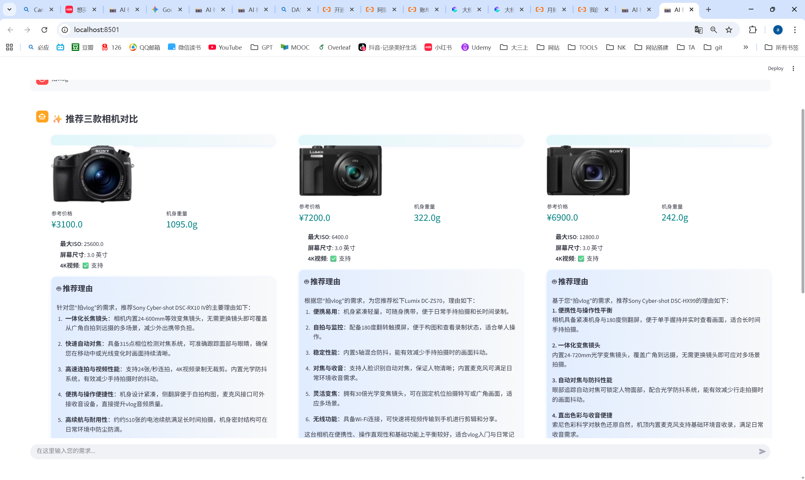

## 进度

## 实现介绍

### 数据库：postgresql（pgAdmin 4）

### 12-w1-数据收集
CameraDatabase数据集
来源：https://codeload.github.com/leavestylecode/CameraDatabase/

数据集包含以下字段：

| 英文字段 | 中文翻译 | 描述 |
|---------|----------|------|
| Brand | 品牌 | 相机制造商 |
| Model | 型号 | 相机型号名称 |
| Year | 年份 | 发布年份 |
| image_file | 图像文件 | 相机图像的路径 |
| Total megapixels | 总像素 | 总百万像素数 |
| Exposure Compensation | 曝光补偿 | 可用的曝光补偿范围 |
| Normal focus range | 正常对焦范围 | 常规对焦距离范围 |
| Battery | 电池 | 电池类型 |
| Sensor resolution | 传感器分辨率 | 分辨率（像素宽 x 高） |
| Crop factor | 裁切系数 | 传感器裁切系数 |
| Sensor type | 传感器类型 | 图像传感器类型（CCD、CMOS等） |
| Dimensions | 尺寸 | 物理尺寸（毫米） |
| Max aperture | 最大光圈 | 最大光圈值 |
| Min. shutter speed | 最慢快门速度 | 最慢快门速度 |
| White balance presets | 白平衡预设 | 白平衡预设数量 |
| Macro focus range | 微距对焦范围 | 微距摄影的最小对焦距离 |
| Optical zoom | 光学变焦 | 是否具有光学变焦功能 |
| USB | USB接口 | USB接口类型 |
| Weight | 重量 | 相机重量（克） |
| Max. aperture (35mm equiv.) | 最大光圈（35mm等效） | 35mm等效的最大光圈 |
| Focal length (35mm equiv.) | 焦距（35mm等效） | 35mm等效的焦距范围 |
| Also known as | 又称为 | 替代名称或型号 |
| Aperture priority | 光圈优先 | 是否具有光圈优先模式 |
| Max. image resolution | 最大图像分辨率 | 最大图像分辨率（像素） |
| Max. shutter speed | 最快快门速度 | 最快快门速度 |
| Storage types | 存储类型 | 兼容的存储介质 |
| Effective megapixels | 有效像素 | 用于图像捕获的有效百万像素 |
| Megapixels | 百万像素 | 营销百万像素计数 |
| Max. video resolution | 最大视频分辨率 | 最大视频分辨率 |
| Screen size | 屏幕尺寸 | 液晶屏幕尺寸（英寸） |
| Metering | 测光 | 可用的测光模式 |
| Digital zoom | 数码变焦 | 是否具有数码变焦功能 |
| Shutter priority | 快门优先 | 是否具有快门优先模式 |
| Sensor size | 传感器尺寸 | 物理传感器尺寸（毫米） |
| Viewfinder | 取景器 | 取景器类型 |
| Screen resolution | 屏幕分辨率 | 液晶屏幕分辨率（点） |
| ISO | ISO感光度 | 可用的ISO感光度范围 |

### 12-w2-数据清洗

进行了相机数据的清洗，以便后续能更好地被用于推荐系统的计算。

清洗的大致思路是：将大部分关键技术指标列直接清洗为纯数值并重命名，以便于推荐系统进行排序和计算；同时，严格保留少数包含复杂文本信息的原始列。

清洗分为两部分：
1. 格式清洗：把信息转换为纯数值，并统一了单位或提取了关键数值
2. 新增评分：生成新的分析列，并创建了三个核心的百分制评分指标（这个评分指标的详细计算方式或许后续还会修改）

#### 格式清洗

| 原始列名 | 清洗方式 | 最终列名 | 含义 (清洗后) |
| :--- | :--- | :--- | :--- |
| **`Weight`** | 提取数值，统一为**克 (g)**。 | `Weight_g` | 相机净重 (克)。 |
| **`ISO`** | 提取 ISO 范围中的**最大值**。 | `Max_ISO` | 相机最高感光度。 |
| **`Min. shutter speed`** | 提取快门速度，统一为**秒数**。 | `Min_Shutter_Speed_Sec` | 最慢快门速度 (秒)。 |
| **`Max. shutter speed`** | 提取快门速度，统一为**秒数**。 | `Max_Shutter_Speed_Sec` | 最快快门速度 (秒)。 |
| **`Exposure Compensation`** | 提取曝光补偿范围的**最大绝对值 (EV)**。 | `Max_Exposure_Comp` | 最大曝光补偿范围。 |
| **`Screen resolution`** | 提取屏幕分辨率的**点数**。 | `Screen_Res_Dots` | 屏幕分辨率（点数）。 |
| **`Screen size`** | 提取屏幕尺寸的**英寸**数值。 | `Screen_Size_in` | 屏幕对角线尺寸（英寸）。 |
| **`Normal focus range`** | 提取对焦距离，统一为**厘米 (cm)**。 | `Normal_Focus_cm` | 常规对焦最小距离（厘米）。 |
| **`Macro focus range`** | 提取对焦距离，统一为**厘米 (cm)**。 | `Macro_Focus_cm` | 微距对焦最小距离（厘米）。 |

#### 新增评分

| 原始列名 | 派生新列名 | 清洗方式 | 作用 |
| :--- | :--- | :--- | :--- |
| **`Max aperture`** | `Min_Aperture_F` | 提取光圈范围中**数值上最小的 F 值**（即最大光圈）。 | 用于计算弱光性能评分。新列紧跟在原列后面。 |
| **`Dimensions`** | `Dim_L`, `Dim_W`, `Dim_H` | 使用更精确的正则表达式，从字符串中分离出**长、宽、高**的数值。 | 用于计算体积和便携性评分。 |
| **`Max. video resolution`** | `Supports_4K` | 检查字符串中是否包含 `4K`、`3840` 或 `4096`，并生成 **布尔值 (True/False)**。 | 用于计算视频性能评分。 |

这里变成4k支持，因为感觉有些人有这个拍摄需求

| 派生指标 | 构成指标和权重 | 目的 |
| :--- | :--- | :--- |
| **`Portability_Score`** | `Weight_g` (60%) + `Dim_L/W/H` (体积) (40%) | 衡量相机的轻便性，得分越高代表越轻巧。 |
| **`LowLight_Score`** | `Max_ISO` (50%) + `Min_Aperture_F` (30%) + `Crop factor` (20%) | 衡量相机在弱光环境下的成像能力。 |
| **`Video_Score`** | `Supports_4K` (40%) + `Screen_Size_in` (30%) + `Max_Shutter_Speed_Sec` (30%) | 衡量相机在视频拍摄和Vlog方面的性能。 |

一些对于指标权重的解释：

| 派生指标 | 构成指标与权重 (变量名/中文) | 核心原理与用途 (更浅显易懂) |
| :--- | :--- | :--- |
| **`Portability_Score (便携性评分)`** | **`Weight_g (重量)` (60%)** + **`Dim_L/W/H (体积)` (40%)** | **用途：** **衡量带出门的方便程度。** 分数越高，相机越轻巧、越紧凑，旅行或日常携带越轻松。重量的影响最大。 |
| **`LowLight_Score (弱光性能评分)`** | **`Max_ISO (最大ISO)` (50%)** + **`Min_Aperture_F (最小光圈F值)` (30%)** + **`Crop factor (裁切系数)` (20%)** | **用途：** **评估夜间或室内拍摄的清晰度。** 结合了相机“进光量”(光圈大小)和“感光能力”（ISO/传感器），分数越高，在光线不足的环境下越能拍出清晰、噪点少的照片。 |
| **`Video_Score (视频性能评分)`** | **`Supports_4K (4K支持)` (40%)** + **`Screen_Size_in (屏幕尺寸_英寸)` (30%)** + **`Max_Shutter_Speed_Sec (最快快门速度_秒)` (30%)** | **用途：** **评估相机是否适合现代视频和Vlog。** 确保支持高质量的 4K 画质，同时拥有方便监看的大屏幕和足够快的处理速度（体现在快门速度上），保证视频录制的流畅体验。 |

视频性能评分的指标权重后续可能会修改

## 12-w3 基本框架的搭建-基本跑通系统

版本1：放任用户自己问问题，但我感觉有时候需求输入太模糊了很难判断

版本2：给出每个需求方向的选项（具体选项参考了这个https://github.com/KevinWang15/fuzzy-expert-system-buy-dslr-camera

目前存在的问题：
1. llm选择还没定下来，感觉openai的适配性比较好？
2. 感觉选项有点太固定了？后续扩展到多个品类的时候适配起来感觉有点难度，或者可以在系统前一页先让用户选要推荐的品类
3. 目前可视化出来的图表太少，而且不够精美
4. 相机数据的价格部分不准确，有些停产的相机可以被删掉了，太老旧，可以重新弄下数据！
5. 页面不够好看，应该把相机照片放上来，品牌和相关参数都列出来

## 12-w4 改进相机推荐（聊天方式+推荐机制+页面呈现）

1. 取消选项控件，把系统改成聊天式，并重新设计可缺省的结构化信息，让大模型在对话里自动补全。
2. 对话支持衔接历史内容，AI会参考上一段对话进行连续回复。
3. 修改相机数据，只保留近七年生产的（2017年-2024年）相机的信息（后续应该会添加2025年的数据
4. 调整布页面布局，提供三个相机推荐供用户选择，增加相机参数介绍和可视化图表的分析部分
5. 添加相机的图片数据
6. 优化了推荐和映射规则，其中尤其调整了：强调vlog时要轻便+video score都考虑

**发现的问题，但还没改出来：**
1. 实现多品类在同一聊天窗口的扩展（hard
2. 根据不同场景建立一些默认推荐选项集合（比如当用户有vlog需求时，优先考虑：pocket3、索尼zv-1m2、索尼ZV-E10M2 、canon g7x2等，如果有额外需求再在默认集合里进行筛选。但是发现实际检测中还是在优先考虑评分高的，没有优先选择我的推荐机型集合里的，是不是我的评分体系有问题
3. 感觉我选的相机年份还是有点太多了，1718年的相机是不是有点过时了？这个数据数量有要求吗

