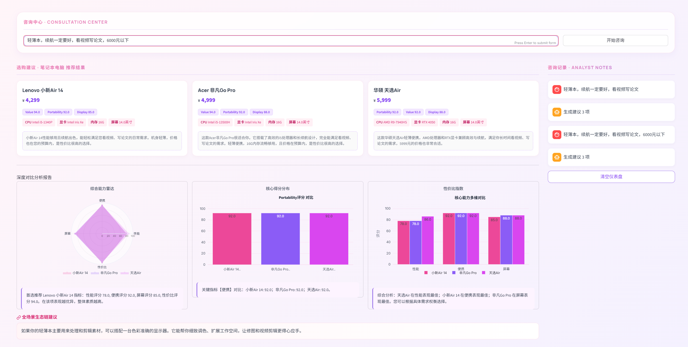

# 案例1

### **咨询中心 · CONSULTATION CENTER**

**输入框内容**：

> 轻薄本，续航一定要好，看视频写论文，6000元以下

**按钮**：

* 开始咨询

---

### **选购建议 · 笔记本电脑 推荐结果**

1. **Lenovo 小新Air 14**

   * 价格：¥4,299
   * 标签：

     * Value 94.0
     * Portability 92.0
     * Display 85.0
     * CPU: Intel i5-1340P
     * 显卡: Intel Iris Xe
     * 内存: 16G
     * 屏幕: 14.0英寸
   * 简评：

     > 小新Air 14性能够用且续航出色，能轻松满足您看视频、写论文的日常需求。机身轻薄，价格也在您的预算内，是性价比最高的选择。

2. **Acer 非凡Go Pro**

   * 价格：¥4,999
   * 标签：

     * Value 94.0
     * Portability 92.0
     * Display 88.0
     * CPU: Intel i5-13500H
     * 显卡: Intel Iris Xe
     * 内存: 16G
     * 屏幕: 14.0英寸
   * 简评：

     > 这款Acer非凡Go Pro很适合你。它搭载了高效的i5处理器和长续航设计，完全能满足看视频、写论文的需求。轻薄便携，16G内存流畅够用，且价格在预算内，是性价比很高的选择。

3. **华硕 天选Air**

   * 价格：¥5,999
   * 标签：

     * Portability 92.0
     * Value 92.0
     * Display 88.0
     * CPU: AMD R9-7940HS
     * 显卡: RTX 4050
     * 内存: 16G
     * 屏幕: 14.0英寸
   * 简评：

     > 这款华硕天选Air轻薄便携，AMD处理器和RTX显卡兼顾高效与续航，满足您长时间看视频、写论文的需求。5999元的价格也非常合适。

---

### **深度对比分析报告**

1. **综合能力雷达图**

   * 指标：

     * 性能：小新Air 14 78，非凡Go Pro 78，天选Air 86
     * 便携：92
     * 屏幕：小新Air 14 85，非凡Go Pro 88，天选Air 88
     * 性价比：小新Air 14 94
   * 分析：

     > 首选推荐 Lenovo 小新Air 14 指标：性能评分78.0，便携评分92.0，屏幕评分85.0，性价比评分94.0。在该项表现最优，整体素质超高。

2. **核心评分分布（Portability评分对比）**

   * 小新Air 14：92.0
   * 非凡Go Pro：92.0
   * 天选Air：92.0
   * 分析：便携度三者相同

3. **性价比指数（核心能力多维对比）**

   * 性能：

     * 小新Air 14：78.0
     * 非凡Go Pro：78.0
     * 天选Air：86.0
   * 便携：三款均92.0
   * 屏幕：

     * 小新Air 14：85.0
     * 非凡Go Pro：88.0
     * 天选Air：88.0
   * 分析：

     > 综合分析：天选Air在性能表现最佳；小新Air 14在便携表现最佳；非凡Go Pro在屏幕表现最佳。您可以根据具体需求权衡选择。

---

### **全场景生态链建议**

> 如果你的轻薄本主要用来处理和剪辑素材，可以搭配一台色彩准确的显示器。它能帮你细致调色、扩展工作空间，让修图和视频剪辑更得心应手。

---

### **咨询记录 · ANALYST NOTES**

1. 轻薄本，续航一定要好，看视频写论文
2. 生成建议 3 项
3. 清空仪表盘按钮

# 案例二

## 第一次询问

### **咨询中心 · CONSULTATION CENTER**

**输入框内容**：

> 不差钱，可以玩顶级3A游戏的显卡

**按钮**：

* 开始咨询

---

### **选购建议 · 显卡 推荐结果**

1. **NVIDIA GeForce RTX 4060 Ti 16GB**

   * 价格：¥3,499
   * 标签：

     * ThreeDMark 17800
     * Thermal 92.0
     * Creative 82.0
     * 显存: 16GB
     * 芯片: -
     * 功耗: 165W
   * 简评：

     > 预算无上限的顶级游戏玩家首选，RTX 4060 Ti 16GB不仅拥有充足的显存应对未来3A大作，其高性能AD106芯片与高能散热设计，确保了4K高画质下依然流畅的沉浸式游戏体验。

2. **Intel Arc B770**

   * 价格：¥2,799
   * 标签：

     * ThreeDMark 22000
     * Thermal 88.0
     * Value 86.0
     * 显存: 16GB
     * 芯片: -
     * 功耗: 220W
   * 简评：

     > 预算充足就选它！16GB大显存从容应对顶级3A大作，性能强劲功耗低，畅玩高画质无压力。

3. **NVIDIA GeForce RTX 4060 Ti**

   * 价格：¥3,199
   * 标签：

     * ThreeDMark 17500
     * Thermal 92.0
     * Value 84.0
     * 显存: 8GB
     * 芯片: -
     * 功耗: 160W
   * 简评：

     > 显卡性能拉满，RTX 4060 Ti功能低性能强劲，轻松畅玩顶级3A大作，帧数稳定画面流畅。

---

### **深度对比分析报告**

1. **综合能力雷达图**

   * 指标：

     * 游戏性能、创作性能、功耗散热、性价比
   * 分析：

     > 首选推荐 NVIDIA GeForce RTX 4060 Ti 16GB 指标：游戏性能评分80.0，创作性能评分82.0，功耗散热评分92.0，性价比评分82.0。在该项表现优异，整体素质超高。

2. **核心评分分布（Gaming评分对比）**

   * GeForce RTX 4060 Ti 16GB：80.0
   * Arc B770：80.0
   * 分析：

     > 关键指标【游戏性能】对比：GeForce RTX 4060 Ti 16GB 80.0；Arc B770 80.0；GeForce RTX 4060 Ti 78.0。

3. **性价比指数（核心能力多维对比）**

   * 游戏性能：

     * RTX 4060 Ti 16GB 80.0
     * Arc B770 80.0
     * RTX 4060 Ti 78.0
   * 创作性能：

     * 82.0、82.0、80.0
   * 功耗散热：

     * 92.0、88.0、92.0
   * 分析：

     > 综合分析：GeForce RTX 4060 Ti 16GB在游戏性能表现最佳；在创作性能表现最佳；在功耗散热表现最佳。您可以根据具体需求权衡选择。

---

### **全场景生态链建议**

> 都上顶级显卡了，画面必须拉满才过瘾！配一台4K高刷显示器，能完全发挥这块显卡的潜力，画面细节和丝滑流畅一次到位。再搭一套高保真耳机，全景声效一开，游戏的沉浸感和临场感直接拉满，这才是玩3A大作的正确方式。

---

### **咨询记录 · ANALYST NOTES**

1. 轻薄本，续航一定要好，看视频写论文
2. 生成建议 3 项
3. 轻薄本，续航一定要好，看视频写论文，6000元以下
4. 生成建议 3 项
5. 不差钱，可以玩顶级3A游戏的电脑
6. 生成建议 3 项
7. 配合高分辨率、高刷新率的电竞显示器
8. 生成建议 3 项
9. 不差钱，可以玩顶级3A游戏的显卡
10. 生成建议 3 项

## 第二次询问

以下是图片中的文字信息提取与整理：

---

### **咨询中心 · CONSULTATION CENTER**

**配台高分辨率、高刷新率的电竞显示器**  
开始咨询

---

### **选购建议 · 显示器 推荐结果**

#### **LG 27GR95QE**  
¥ 9,999  
- Display: 98.0  
- Performance: 98.0  
- Ergonomics: 88.0  
- 尺寸: 27.0英寸  
- 分辨率: 2560x1440  
- 刷新率: 240Hz  

#### **LG 27GR950**  
¥ 4,999  
- Display: 96.0  
- Performance: 95.0  
- Ergonomics: 88.0  
- 尺寸: 27.0英寸  
- 分辨率: 3840x2160  
- 刷新率: 144Hz  

#### **Gigabyte M27Q**  
¥ 2,299  
- Display: 94.0  
- Performance: 94.0  
- Ergonomics: 88.0  
- 尺寸: 27.0英寸  
- 分辨率: 2560x1440  
- 刷新率: 170Hz  

---

**推荐搭配M27Q电竞显示器**，27英寸2K分辨率搭配170Hz高刷新率，画面细腻流畅，大幅提升游戏体验的视觉感受与沉浸感。适合追求高画质与流畅响应效果的玩家。

---

### **生成建议**  
- 生成建议 3项：轻薄本、续航一定要好，看视频写论文  
- 生成建议 3项：轻薄本、续航一定要好，看视频写论文，6000元以下  
- 生成建议 3项：不差钱，可以玩顶级3A游戏的电脑  
- 生成建议 3项：配台高分辨率、高刷新率的电竞显示器  
- 生成建议 3项  
- 清空仪表盘

---

### **核心得分分布**

| 型号     | 性能 | 人体工学 | 性价比 |
| -------- | ---- | -------- | ------ |
| 27GR95QE | 98.0 | 88.0     | 68.0   |
| 27GR950  | 95.0 | 88.0     | —      |
| M27Q     | 94.0 | 88.0     | —      |

---

### **核心能力多维对比**

- **性能**：27GR95QE: 98.0；27GR950: 95.0；M27Q: 94.0  
- **综合分析**：  
  - 27GR95QE 在画质表现最佳  
  - 27GR950 在性能表现最佳  
  - 27GR95QE 在人体工学表现最佳  
  您可以根据具体需求权衡选择。

---

### **深度对比分析报告**

#### **综合能力雷达**  
（性能、人体工学、性价比三项对比）

#### **首选推荐**  
**LG 27GR95QE**  
- 画质评分: 98.0  
- 性能评分: 98.0  
- 人体工学评分: 88.0  
- 性价比评分: 68.0  
在该项表现最优，整体素质最高。

---

### **全场景生态链建设**  
有了这台高刷高分辨率电竞屏，记得配上高性能游戏本或显卡，才能让高帧率和超高画质同时拉满，丝滑操作+清晰细节，真正沉浸在你的专业战场里。

# 案例三

### **咨询中心 · CONSULTATION CENTER**

**输入框内容**：

> 5000元以内拍vlog的相机

**按钮**：

* 开始咨询

---

### **选购建议 · 相机 推荐结果**

1. **DJI Osmo Pocket 3**

   * 价格：¥3,499
   * 标签：

     * Portability 98.0
     * Video 95.0
     * LowLight 70.0
     * 像素: NoneMP
     * ISO: 6400.0
     * 重量: 179.0g
     * 4K: 是
   * 简评：

     > 大疆Pocket 3单手就能握持，视频画质出色，对焦又快又准，无论白天还是傍晚都能拍出清晰的vlog，非常值得入手。

2. **DJI Osmo Action 4**

   * 价格：¥2,199
   * 标签：

     * Portability 99.0
     * Video 92.0
     * LowLight 65.0
     * 像素: NoneMP
     * ISO: 12800.0
     * 重量: 145.0g
     * 4K: 是
   * 简评：

     > DJI Action 4是Vlog神器！价格仅两千出头，画质出色，尤其在低光下表现稳定。它超级便携，操作简单，能轻松应对户外和日常拍摄，是性价比超高的创作伙伴。

3. **Canon PowerShot G7 X Mark III**

   * 价格：¥4,200
   * 标签：

     * LowLight 93.85805912
     * Video 79.55800335
     * Portability 29.20524261
     * 像素: NoneMP
     * ISO: 25600.0
     * 重量: 304.0g
     * 4K: 是
   * 简评：

     > 佳能G7 X Mark III在vlog相机中堪称均衡之选，4K视频画质优秀，翻转触控屏方便自拍，4200元的价格在预算内同时兼顾了便携与专业视频性能。

---

### **深度对比分析报告**

1. **综合能力雷达图**

   * 指标：

     * 便携性：Osmo Pocket 3 98.0，Osmo Action 4 99.0，PowerShot G7 X III 29.2
     * 低光画质：70.0、65.0、93.86
     * 视频能力：95.0、92.0、79.56
   * 分析：

     > 首选推荐 DJI Osmo Pocket 3 指标：便携性评分98.0，低光画质评分70.0，视频能力评分95.0。在该项表现优异，整体素质超高。

2. **核心评分分布（Video评分对比）**

   * Osmo Pocket 3：95.0
   * Osmo Action 4：92.0
   * PowerShot G7 X III：79.55800335
   * 分析：视频能力 Osmo Pocket 3 最优

3. **性价比指数（核心能力多维对比）**

   * 便携性：

     * Osmo Pocket 3：98.0
     * Osmo Action 4：99.0
     * PowerShot G7 X III：29.2
   * 低光画质：

     * 70.0、65.0、93.86
   * 视频能力：

     * 95.0、92.0、79.56
   * 分析：

     > 综合分析：Osmo Action 4在便携性表现最佳；PowerShot G7 X III在低光画质表现最佳；Osmo Pocket 3在视频能力表现最佳。您可以根据具体需求权衡选择。

---

### **全场景生态链建议**

> 拍vlog要效率高，除了好相机，配个能随时预览和剪辑的平板电脑会更顺手——相机直连传输素材，大屏剪辑比手机舒服很多。

---

### **咨询记录 · ANALYST NOTES**

1. 5000元以内拍vlog的相机
2. 生成建议 3 项
3. 清空仪表盘按钮

