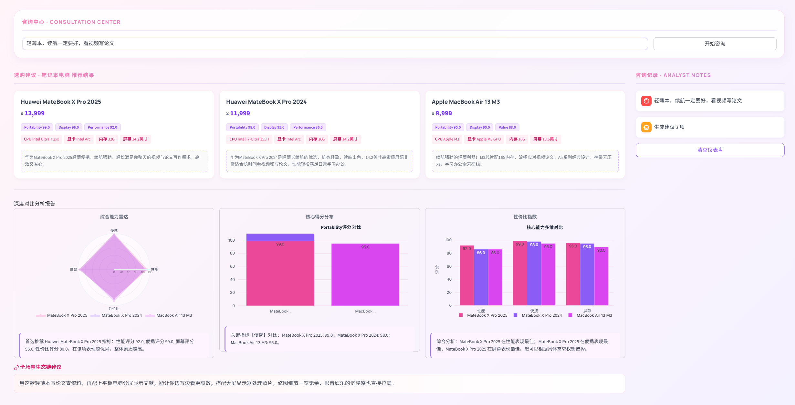
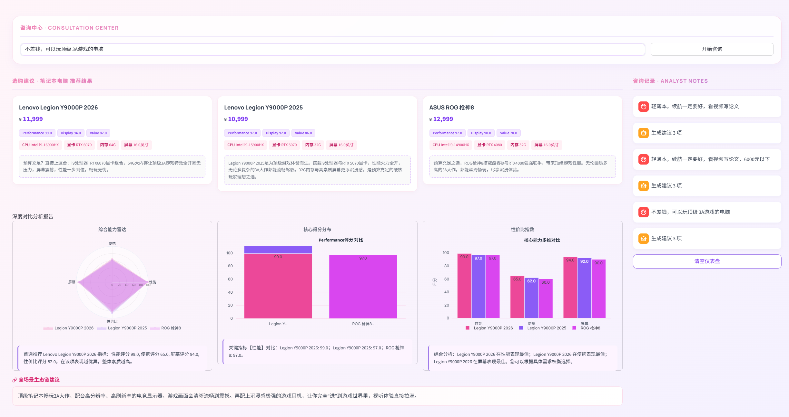
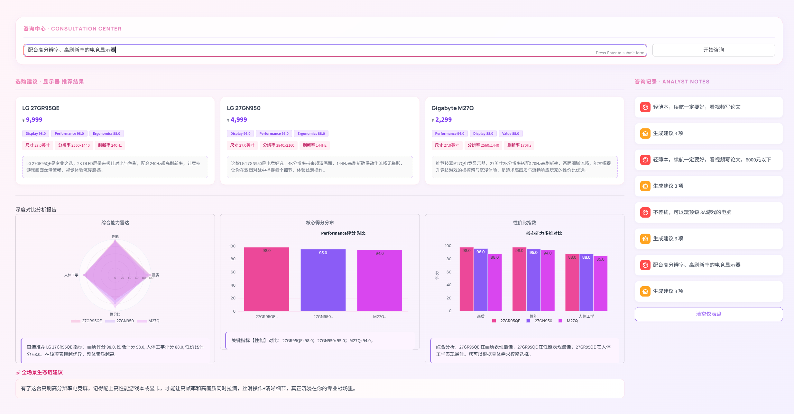
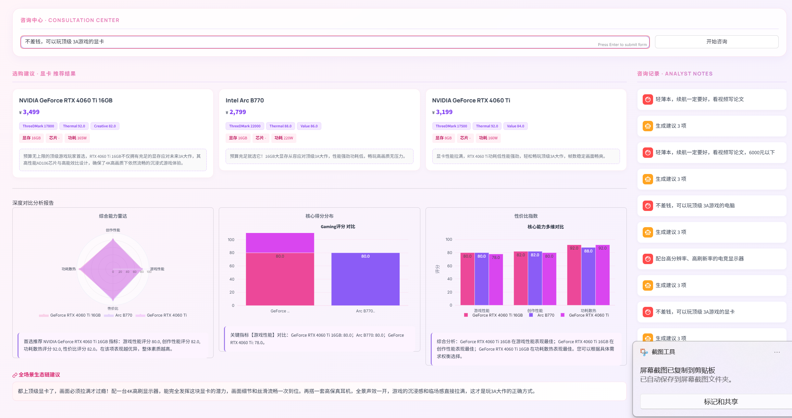
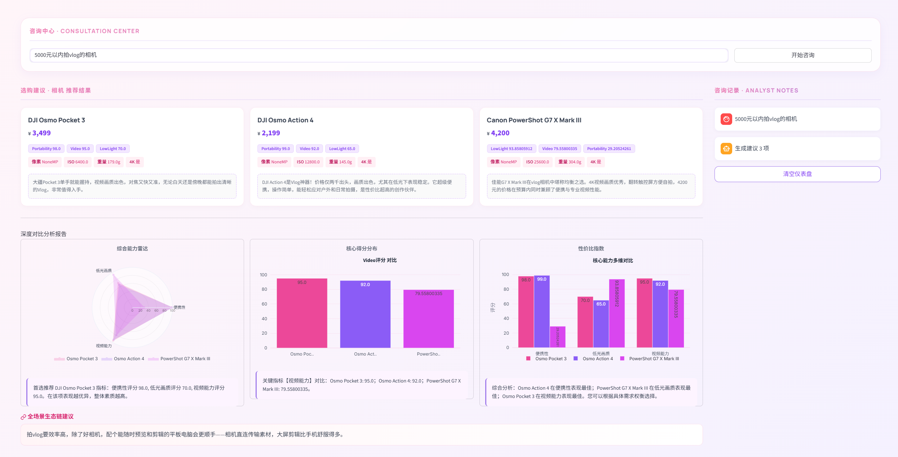

\subsection{案例 1：大学生的轻薄办公场景（笔记本电脑）}

**场景预设**

用户 A 是一名刚入学的大学生，对电脑硬件参数了解不多。其需求较为明确：日常在图书馆写论文、看视频，需要频繁携带外出，对续航和便携性较为敏感，预算在 6000 元以内。他在输入框中写道：

\begin{quote}
"轻薄本，续航一定要好，看视频写论文，6000元以下。"
\end{quote}

**交互与推理过程**

系统接收请求后，首先通过 \texttt{CategoryDetector} 的语义匹配逻辑，从"写论文"、"图书馆"等关键词中精准识别出 \texttt{laptop}（笔记本电脑）品类。随后，\texttt{MultiCategoryAgent} 将任务路由至 \texttt{LaptopAgent}。

在意图解析阶段，LLM 识别出"续航一定要好"这一强约束偏好，并结合"看视频写论文"的使用描述，将场景锁定为 \texttt{light\_office}（轻薄办公）。系统随即触发预设的权重分配方案：将性能评分（\texttt{Performance\_Score}，权重 0.4）、便携评分（\texttt{Portability\_Score}，权重 0.3）与屏幕评分（\texttt{Display\_Score}，权重 0.3）作为多维评价的核心。由于用户明确提及"6000元以下"的预算限制，系统在意图对象中将 \texttt{max\_price} 硬性锁定为 6000，并将 \texttt{Value\_Score}（性价比评分）设为默认排序字段，以平衡性能表现与资金投入。

**结果呈现**

系统推荐了三款机型：联想小新 Air 14（¥4,299）、宏碁非凡 Go Pro（¥4,999）与华硕天选 Air（¥5,999）。三款产品的便携性评分均为 92.0，在用户最关注的核心维度上不相上下；差异主要体现在其余维度上——小新 Air 14 性价比评分以 94.0 居首，屏幕评分为 85.0；非凡 Go Pro 性价比同为 94.0，屏幕评分提升至 88.0，但售价高出 700 元；天选 Air 凭借 AMD R9-7940HS 处理器与 RTX 4050 独显将性能评分拉至 86.0，但性价比评分相应降至 92.0，售价也达到预算上限的 5,999 元。

系统为每款产品生成了简短的场景化评语，直接说明产品与用户使用场景的契合点，避免堆砌参数。深度对比分析报告进一步提供了三个层次的横向比较：综合能力雷达图呈现四维能力分布，核心评分分布专项对比便携性数据，多维对比则明确指出各款产品的相对优势——"天选 Air 在性能表现最佳；小新 Air 14 在性价比表现最佳；非凡 Go Pro 在屏幕表现最佳"——将取舍判断的依据清晰交还给用户。

此外，系统在页面末尾附上了生态链延伸建议："如果轻薄本主要用来处理和剪辑素材，可以搭配一台色彩准确的显示器。"该建议并非用户此次咨询的核心诉求，但体现了系统对用户潜在使用场景扩展的主动预判，在完成即时推荐任务的同时为后续可能的追加咨询提供了自然的引导入口。

---

\subsection{案例 2：极致性能的游戏发烧场景（跨品类生态组合）}

**场景预设**

用户 B 是一名资深游戏玩家，预算充裕，追求顶级游戏体验。市面上顶级配件太多，组合方式繁复，他不想花几个周末去挨个研究兼容性和最新发布的型号，也不希望花费大量精力逐一核查各配件的兼容性与搭配关系，倾向于获得完整的配置建议。他在输入框中写道：

\begin{quote}
"不差钱，可以玩顶级 3A 游戏的显卡。"
\end{quote}

**第一轮交互：显卡推荐**

系统通过 \texttt{GPUAgent} 处理该请求。解析过程中，系统识别到用户输入的"不差钱"关键词，触发了针对极端性能词汇的补丁逻辑（Patch Logic）：将 \texttt{max\_price} 阈值上调至 999,999 元，并自动将最优排序字段（\texttt{sort\_field}）映射为该品类最核心的创作性能维度（\texttt{Creative\_Score}），以确保推荐结果聚焦于顶级规格。

最终推荐结果包含三款产品：NVIDIA GeForce RTX 4060 Ti 16GB（¥3,499）、Intel Arc B770（¥2,799）与 NVIDIA GeForce RTX 4060 Ti（¥3,199）。RTX 4060 Ti 16GB 与 Arc B770 在游戏与创作性能评分上完全持平（均为 80.0/82.0），但在功耗散热评分（\texttt{Thermal\_Score}）上，RTX 4060 Ti 16GB 以 92.0 领先。系统在可视化雷达图中完整呈现了 B770 更高的 3DMark 原始跑分，但基于驱动稳定性与生态成熟度的综合博弈，最终将 16GB 版本的 RTX 4060 Ti 列为首选推荐。

完成单品推荐后，系统调用 \texttt{EcosystemConfig} 模块，识别出"游戏"场景下的跨品类关联需求。通过 \texttt{\_generate\_eco\_suggestion\_llm} 函数，系统生成了极具引导性的专业建议："都上顶级显卡了，画面必须拉满才过瘾！配一台 4K 高刷显示器，能完全发挥这块显卡的潜力。" 这一建议成功激发了用户对显示输出端性能对等性的关注。

**第二轮交互：显示器推荐**

用户 B 在看到生态链建议后，认识到显示器与显卡的配套关系值得进一步明确，随即追加输入：

\begin{quote}
"配台高分辨率、高刷新率的电竞显示器。"
\end{quote}

系统将品类切换至显示器，由 \texttt{MonitorAgent} 接手检索，推荐结果包含三款产品：LG 27GR95QE（¥9,999，240Hz / 2560×1440）、LG 27GR950（¥4,999，144Hz / 3840×2160）与技嘉 M27Q（¥2,299，170Hz / 2560×1440）。三款产品人体工学评分均为 88.0，差异集中在画质、性能与性价比三个维度：LG 27GR95QE 画质与性能评分均达 98.0，综合素质最高，但性价比评分仅为 68.0，溢价明显；LG 27GR950 画质评分 96.0、性能评分 95.0，以 4K 分辨率提供了更高的画面精细度；技嘉 M27Q 画质评分 94.0、性能评分 94.0，在三款中性价比最为突出。

系统综合分析指出：27GR95QE 在画质与人体工学表现最佳，27GR950 在性能维度最优，并建议用户根据具体需求权衡选择。同时，系统将技嘉 M27Q 作为性价比导向的重点推荐，指出其 27 英寸 2K 分辨率搭配 170Hz 刷新率的组合能够在合理预算内大幅提升游戏体验。

两轮交互完成后，用户 B 从最初模糊的"顶级游戏显卡"需求，经由生态链建议的自然引导，逐步落地为一套显卡与显示器协同考量的完整配置方案。这一过程体现了系统跨品类推荐链路的设计逻辑：用户无需预先规划所有配件，系统在完成当前品类推荐后主动识别关联需求，以生态链建议作为跨品类跳转的触发机制，将单品咨询有序延伸为场景化的整体方案。

---

\subsection{案例 3：追求性价比的摄影入门场景（相机）}

**场景预设**

用户 C 最近迷上了在社交平台上看别人的 Vlog，开始有了自己记录生活的想法，觉得手机拍出来的画面总差点意思，想买一台相机试试。她在网上查了一些攻略，但"机身防抖""相位对焦""4K 30fps"这些词让她越看越迷糊，攻略里动辄出现的参数对比表也让她不知道该从哪里入手判断。她的需求其实并不复杂：预算 5000 元左右，拍日常 Vlog，希望拍出来的画面稳、对焦不拉风箱、操作别太复杂。她在系统里写道：

\begin{quote}
"5000元以内拍 Vlog 的相机。"
\end{quote}

**交互与推理过程**

系统识别出"Vlog"关键词后，将其映射为 \texttt{CameraAgent} 中的 \texttt{vlog} 场景预设。推理引擎自动从 \texttt{SCENARIO\_PRESETS} 中调取热门候选机型（如 ZV-E10, Pocket, Action 等），并针对该特定场景分配权重：视频能力（\texttt{Video\_Score}）占比 0.3，便携性（\texttt{Portability\_Score}）占比 0.3，而将暗光表现（\texttt{LowLight\_Score}）权重设为最高（0.4），旨在筛选出能够胜任全天候记录的器材。由于预算限制在 5000 元以内，系统过滤了昂贵的专业全画幅型号，优先展示轻量化、高集成度的解决方案。

**结果呈现**

系统推荐了三款产品：大疆 Osmo Pocket 3（¥3,499）、大疆 Osmo Action 4（¥2,199）与佳能 PowerShot G7 X Mark III（¥4,200）。三款产品呈现出明显差异化的能力分布：Osmo Pocket 3 视频能力评分最高（95.0），便携性评分达 98.0，机身仅重 179g，在场景核心维度上综合表现最为突出，系统将其列为首选；Osmo Action 4 便携性评分最优（99.0），机身最轻（145g），ISO 上限更高（12800），更适合户外动态拍摄，且售价仅 2,199 元，性价比突出；PowerShot G7 X Mark III 低光画质评分以 93.86 大幅领先另外两款，但便携性评分仅为 29.2，机身重量达 304g，与另外两款形成鲜明对比，其能力分布与 Vlog 入门场景的核心诉求存在一定错位。

上述差异在雷达图中得到了完整呈现。三款产品在便携性轴线上的分布尤为直观——G7 X Mark III 的便携性短板在图形上一目了然，无需用户逐一比对重量数值即可直观感知。系统进一步在多维对比中明确指出各款产品的相对优势："Osmo Action 4 在便携性表现最佳；PowerShot G7 X Mark III 在低光画质表现最佳；Osmo Pocket 3 在视频能力表现最佳"，将不同优先级下的取舍逻辑清晰呈现，辅助用户根据自身实际拍摄场景完成最终判断。

系统还在结果页末尾附上了生态链建议："拍 Vlog 要效率高，配个能随时预览和剪辑的平板电脑会更顺手——相机直连传输素材，大屏剪辑比手机舒服很多。"该建议将推荐视野从单一设备延伸至创作工作流，对有意持续投入内容创作的用户具有实际参考价值，同时也为后续可能的追加咨询提供了引导入口。

