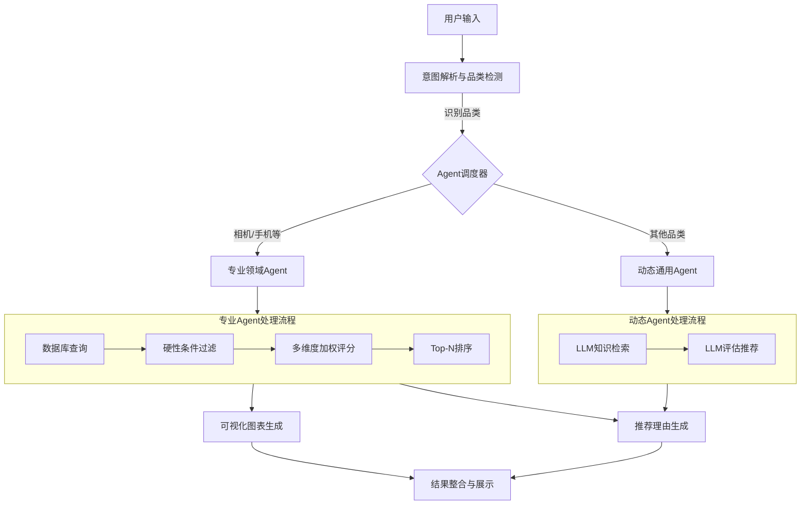

# 第三章 需求分析与方法设计

本章旨在基于实际的用户需求调研结果，明确智能商品推荐系统所需解决的核心问题，并据此设计系统的通用技术路线与架构流程。本章首先通过问卷数据分析用户在选购数码产品时的痛点与需求，随后提出基于多Agent协作的系统总体框架，阐述其工作流程与模块职责，为后续核心算法与系统的具体实现奠定基础。

## 3.1 需求分析

为了深入了解用户在电商环境下进行商品选购时的真实困境与需求，本项目设计并分发了《数码产品选购需求调查问卷》，共回收有效问卷20份。调查对象主要为具有一定网购经验的消费者，样本覆盖了从高频网购（月均7次以上，占比25%）到偶尔网购（月均1-3次，占比20%）的不同群体，具有一定的代表性。

### 3.1.1 用户决策痛点分析

调查结果显示，在购买数码类产品时，65%的用户通常需要“一周以上”的时间才能做出购买决定，这反映了数码产品的高客单价与技术复杂性导致了较长的决策周期。用户在选购过程中面临的主要困难（如图3-1所示）集中在以下几个方面：

1.  **参数专业门槛高**：70%的用户表示“参数太专业，看不懂或不知道哪个更重要”。数码产品涉及大量技术指标（如相机底均大小、光圈、屏幕刷新率等），普通消费者难以建立参数与实际体验的映射关系。
2.  **评论信息噪音大**：60%的用户认为“评论太多太杂，难以判断真实优缺点”。现有的电商评论区充斥着刷单、情绪化表达，使得提取客观评价变得极其困难。
3.  **选择困难**：55%的用户感到“产品太多，不知道从哪几款开始比较”。海量的SKU（库存量单位）使得用户在初始筛选阶段就陷入迷茫。
4.  **价格不确定性**：40%的用户“怕买贵了，不知道什么价格合理”。

此外，针对现有的信息获取渠道（如电商详情页、B站测评、小红书种草等），85%的用户认为最大的不足是“信息分散，需要自己汇总对比”，80%的用户诟病“都是软广，不够客观”。这表明，用户急需一个能够汇聚多方信息、保持客观中立、并能自动进行汇总对比的辅助工具。

### 3.1.2 系统核心功能需求

针对上述痛点，问卷进一步调查了用户对“智能商品推荐工具”的功能期望。数据显示（如图3-2所示），用户最看重的功能依次为：

1.  **推荐理由透明化（80%）**：用户不希望面对一个“黑盒”推荐系统，而是强烈要求工具能够“告诉我每款产品‘推荐/不推荐’的具体理由”。这要求系统具备可解释性（Explainable AI），能够用自然语言阐述推荐逻辑。
2.  **自动化对比分析（65%）**：用户希望工具能“自动对比多款产品的关键参数，生成对比图表”。这意味着系统不仅要推荐，还要提供可视化的决策支持，如雷达图、柱状图等，以直观展示产品差异。
3.  **个性化场景匹配（35%）**：用户希望系统能根据“旅行”、“家用”、“Vlog”等具体使用场景筛选产品，而非仅仅基于价格或销量。
4.  **自然语言交互（30%）**：用户希望能够通过自然语言（如“3000元拍视频的相机”）直接描述需求，系统需具备精准的语义理解能力。

### 3.1.3 设计目标

基于上述需求分析，本系统的设计目标确立为：

1.  **精准的意图理解**：利用大语言模型（LLM）准确解析用户自然语言输入中的显性需求（如价格、品类）与隐性需求（如使用场景、偏好）。
2.  **客观的多维度评价**：建立基于客观参数与专家知识的评分体系，避免单一来源的主观干扰，提供量化的产品评价。
3.  **直观的可视化辅助**：通过图表形式直观呈现产品参数对比，降低用户的信息处理负荷。
4.  **可解释的推荐过程**：生成清晰的推荐理由，增强用户对推荐结果的信任度。

## 3.2 系统总体框架设计

为了实现上述设计目标，本文提出了一种基于**多Agent协作（Multi-Agent Collaboration）**的智能推荐系统架构。该架构通过大语言模型作为核心控制器，协调多个专注于特定任务的Agent，实现了从用户意图解析到最终结果展示的全流程自动化。

### 3.2.1 系统通用流程

系统的工作流程模拟了人类购物顾问的决策过程，主要包含以下几个阶段，如图3-3所示：

1.  **用户输入与意图解析**：用户通过Web界面输入自然语言查询。系统首先调用**CategoryDetector（品类检测Agent）**，利用LLM分析用户输入，识别其关心的核心品类（如“相机”、“手机”）以及关键约束条件（预算、用途）。
2.  **Agent调度与分发**：根据识别到的品类，**MultiCategoryAgent（多品类调度器）**将任务分发给对应的**专业领域Agent**。
    *   对于已预置数据库的品类（如电子产品），调度至**BaseDbAgent**的子类（如`CameraAgent`、`PhoneAgent`）。
    *   对于未预置的长尾品类，调度至**DynamicAgent（动态通用Agent）**，利用LLM的通用知识进行处理。
3.  **数据查询与筛选**：专业Agent根据解析出的意图（价格区间、场景标签），在本地数据库或知识库中进行初筛，过滤掉不符合硬性约束的商品。
4.  **多维度评分与排序**：对通过初筛的候选商品，系统基于预定义的评分模型（Scoring Model）进行打分。评分维度包括通用维度（如性价比）和品类特有维度（如相机的“画质”、手机的“性能”）。
5.  **可视化生成与理由阐述**：根据Top-N推荐结果，调用可视化模块（Visualizer）生成对比图表，同时利用LLM为每款推荐产品生成基于事实的推荐理由。
6.  **结果展示**：最终将推荐列表、对比图表和分析文本整合，返回给用户界面。

### 3.2.2 核心模块功能

1.  **CategoryDetector（品类检测器）**：
    *   **职责**：作为系统的“前台”，负责第一时间的语义分析。它不仅识别品类，还能提取用户描述中的关键属性（如“轻便”、“高画质”），并将其映射为系统可理解的标签。
    *   **机制**：利用LLM的Few-Shot Learning能力，通过Prompt工程引导模型输出结构化的JSON数据。

2.  **MultiCategoryAgent（调度中枢）**：
    *   **职责**：维护系统支持的品类注册表，管理Agent的生命周期。
    *   **机制**：采用注册模式（Registry Pattern），解耦了调度逻辑与具体的推荐逻辑，使得系统易于扩展新品类。

3.  **BaseDbAgent（标准化推荐引擎）**：
    *   **职责**：定义了基于结构化数据的推荐标准流程。所有电子产品类的Agent均继承此类。
    *   **机制**：实现了“筛选-评分-排序”的漏斗模型。它封装了SQLAlchemy查询接口，并定义了`calculate_score`抽象方法，要求子类实现具体的评分逻辑。

4.  **DynamicAgent（长尾补充）**：
    *   **职责**：解决“无法为所有商品建立数据库”的问题。对于系统未预置数据的品类（如“跑鞋”、“咖啡机”），直接利用LLM的通用知识库进行推荐。
    *   **机制**：通过构造包含评分标准的Prompt，让LLM模拟特定领域的专家进行推荐，虽然精度不如数据库模式，但极大扩展了系统的覆盖范围。

5.  **Visualizer（可视化引擎）**：
    *   **职责**：将抽象的数据转化为直观的图表。
    *   **机制**：基于Plotly库，支持动态生成雷达图（展示多维能力均衡度）、散点图（展示价格-性能分布）和柱状图（展示核心参数对比）。

## 3.3 本章小结

本章首先通过问卷调查明确了用户在数码产品选购中面临的信息过载、参数复杂与信任缺失等痛点，确立了推荐理由透明化、可视化辅助决策等核心需求。在此基础上，本文设计了基于多Agent协作的智能推荐系统框架。该框架通过意图解析、动态调度、专业评分与可视化展示的流水线设计，有效解决了用户需求与海量商品信息之间的匹配问题。同时，基于BaseAgent的继承体系与DynamicAgent的兜底机制，保证了系统既能在垂直领域（如电子产品）提供精准的参数级推荐，又能兼容长尾品类的通用推荐，具有良好的扩展性与通用性。下一章将详细阐述在此框架下，核心算法的具体设计与实现细节。
